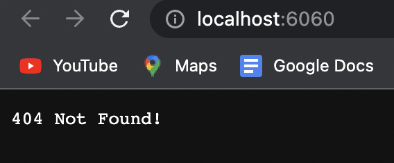
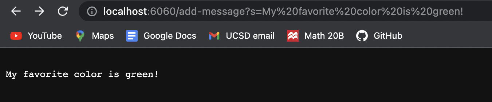

# CSE 15L  w23 Lab Report 2
## SERVERS AND BUGS 
## Aaron Arellano

In this second lab report, we will be demonstrating the creation and function of webservers (week 2 lab), as well as the process of proper debugging for 
creating more efficient programs (week 3 lab). 

# Part #1 - String Server

Before we start the process of creating our own webserver, we must ask, what is a webserver? In essence, it is a server that accepts and reads 
website software and website information. This stored information can be the HTML files used to display the website, as well the as the CSS and
JavaScript code that provides the backend functionality for those websites.

The task in this report was to create a webserver that stored the strings inputted through the path of a given URL. The path will be in the given format.

```
/add-message?s=<string>
```

The path will act as a request to concatenate a new string line to the string variable listed in the StringServer.java class.
The code for my personal StringServer program is shown below.

```
import java.io.IOException;
import java.net.URI;

class Handler implements URLHandler {
    // The one bit of state on the server: a number that will be manipulated by
    // various requests.
    String message = "";

    public String handleRequest(URI url) {
        if(url.getPath().contains("/add-message")){
            String[] args = url.getQuery().split("=");
            String stringToAdd = args[1];
            message+= "\n"+ stringToAdd;
            return message;
        }
        return "404 Not Found!";
    }
}

public class StringServer {
    public static void main(String[] args) throws IOException{
        if(args.length == 0){
            System.out.println("Missing port number! Try any number between 1024 to 49151");
            return;
        }

        int port = Integer.parseInt(args[0]);

        Server.start(port, new Handler());
    }
}

```

After compiling and running the file (with port number 6060), via the lines
```
javac StringServer.java
java StringServer 6060
```
I then proceeded to launch the URL server, giving me the default message of 404 Not Found.



## StringServer example 1



In the first example above, I used the string *My favorite color is Green!* in the query of the URL. This String was then added to the String **message**
variable in the handler class, which is utilized by the String Server class.

1. Which methods were called? - In the beginning from the main method of the string server class, the start method is called from the server.java class, which
was a class provided in the github course wavelet repository.From within the server class, there is a method call to the handle request method found 
in the Handler class, which reads the URL path and stores the string inputs into the message string variable.

2.What are the arguments to those methods? The values of any class fields? - When the start method is called from the server class, the int port
argument is the port number we put when running StringServer (in my example it was 6060), and the second argument was a handler object. Within
the Handler class, the string message field variable is just an empty string. When the handleRequest method is called from the server, it's argument is
a URI object, which contains the url of the website we launched.This url is then scanned for the contents of its path and query.

3.How do the values of class fields change as a result of the request shown in the picture? 
