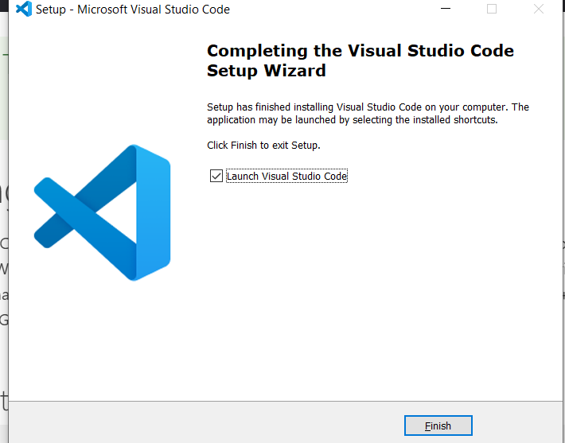
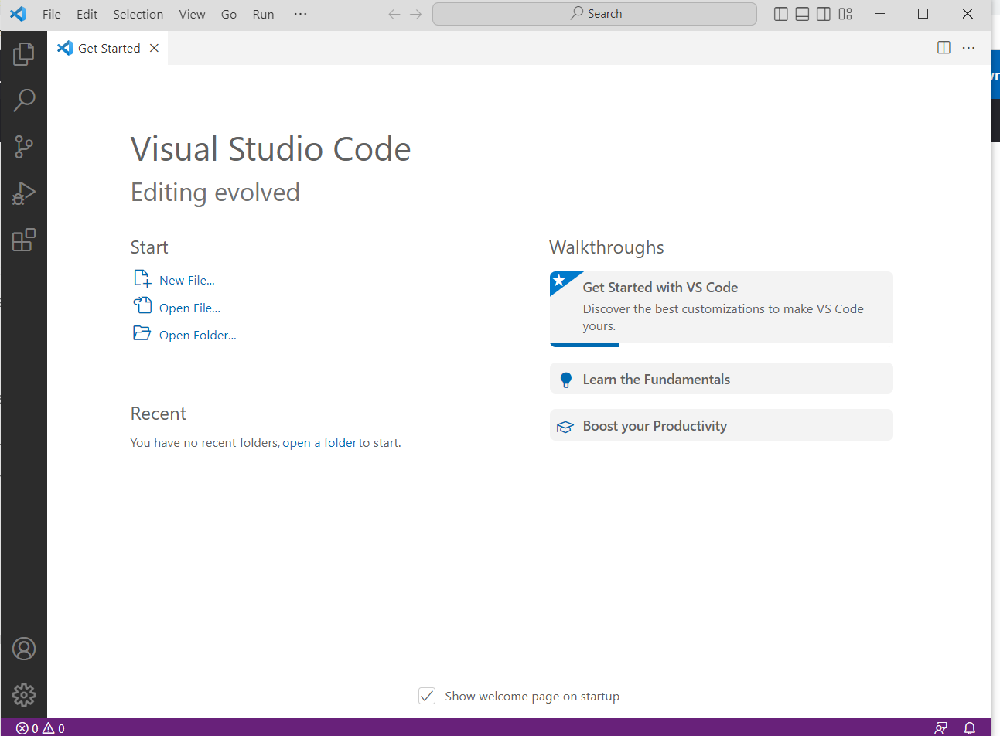

# Lab Report #1
## Aaron Arellano
### Remote Access

In this report, we will be discussing the topic of **remote access**, and using it to connect to our ucsd student accounts and the cse server.

But before we begin, we need to ask ourselves, what is remote access?
In a sense, remote access is the ability to access a specific computer network from anywhere in the world and from any device!
Using this, we can manage files and data for whatever network or computer you're connected to. This will be demonstrated by remotely accessing the UCSD CSE network through our course specific accounts. 

# Step #1 - Installing VS CODE
However, before we start with the process of remote access, we will need to download an IDE called **Visual Studio Code**
We will be using the terminal in VS code to be able to access the network.

- Head to the link below to download VS Code for your respective system (Windows, MacOS)
- [https://code.visualstudio.com/download](https://code.visualstudio.com/download)
- Follow the installation instructions on the downloaded application until you get to the following page. 

- Once you see that page, proceed by clicking the install button and then waiting for the installation process to finalize. Afterwards, you should get a page that looks like this...

If you see this page, then you have successfully installed VS code and are ready to use the terminal!

# Step #2 - REMOTELY CONNECTING

 

