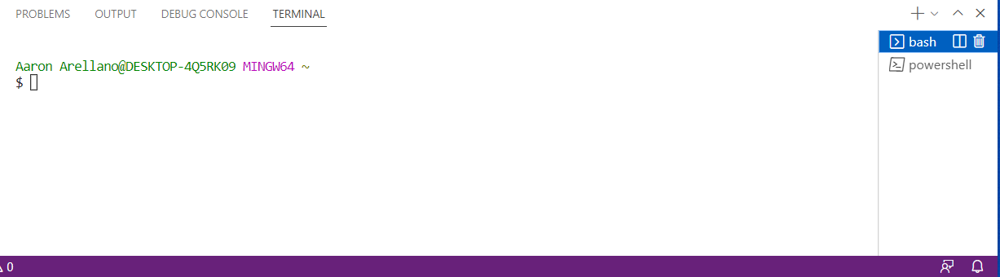

# Lab Report #1
## Aaron Arellano
### Remote Access

In this report, we will be discussing the topic of **remote access**, and using it to connect to our ucsd student accounts and the cse server.

But before we begin, we need to ask ourselves, what is remote access?
In a sense, remote access is the ability to access a specific computer network from anywhere in the world and from any device!
Using this, we can manage files and data for whatever network or computer you're connected to. This will be demonstrated by remotely accessing the UCSD CSE network through our course specific accounts. 

# Step #1 - Installing VS CODE

However, before we start with the process of remote access, we will need to download an IDE called **Visual Studio Code**
We will be using the terminal in VS code to be able to access the network.

- Head to the link below to download VS Code for your respective system (Windows, MacOS)
- [https://code.visualstudio.com/download](https://code.visualstudio.com/download)
- Follow the installation instructions on the downloaded application until you get to the following page.
 

- Once you see that page, proceed by clicking the install button and then waiting for the installation process to finalize. Afterwards, you should get a page that looks like this...

If you see this page, then you have successfully installed VS code and are ready to use the terminal!

## Installing and using GitBash (Windows ONLY, skip if on a different OS)

Before beginning with the remote access portion of the lab, windows users will first need to download Git for windows, which contains useful tools for developing with GitHub and VS Code

1. Head to the following link to install git for your windows system - [https://gitforwindows.org/](https://gitforwindows.org/)
2. After you've installed git for your system, go to VS code and open a new terminal, either with *Ctrl* + `, or by going to the menu, selecting **Terminal** and then **New Terminal**
3. Open the command pallete, which looks like a search bar, by pressing *Ctrl* + *Shift* + *P*. Type *Select default profile* , and then choose GitBash from the drop down options that appear.
4. Go back to your terminal and click on the + button on the top right. This will create a new GitBash terminal, which can be seen in the new dropdown shown below.

You can use the dropdown to switch between powershell and gitbash terminals whenever needed. 

# Step #2 Remotely Connecting

Now that we are on a gitbash (or regular) terminal in VS Code, we can begin the process of remotely connecting to a computer in the cse basement/network. First, we are going to need to look up our course specific accounts for CSE 15L. To do this,
- visit this website - [https://sdacs.ucsd.edu/~icc/index.php](https://sdacs.ucsd.edu/~icc/index.php)
- After you log in using your school username and password, go the section titled **Additional Accounts**, which should contain your username for the CSE 15L course. Keep note of this username.

1. Open the VS Code Terminal (Bash or other terminal depending on system), and type out the following,

**ssh cse15Lwi23(course username letters)@ieng6.ucsd.edu**

If you noticed, the first part of the email consists of the CSE 15L course username, type out your specific username you found earlier.

2. After you have typed out the message in the terminal and pressed enter, you should receive a message that says that the authenticity of the host can't be established, and asks if you would like to continue connecting. Type **yes** and then press enter. This message likely appears because it is your first time connecting to the network.
3. Input the password for your school credentials. Keep in mind the password won't show on the terminal for privacy reasons.
4. Afterwards, your terminal should look something like this,

If your terminal presents the following information, than Congratulations! You've connected to a cse computer! If something went wrong, go back and make sure you input your information properly. The terminal should present information such as the different Host rooms in the cse basement, as well as the amount of users conncted to them.

# Step #3 Trying Out Commands

Now that you've successfully conncted to a compouter in the cse basement, we can start trying out certain **Terminal Commands!**
In essence, terminal commands are used to navigate a computers files and directories and make changes to them!

 

 

